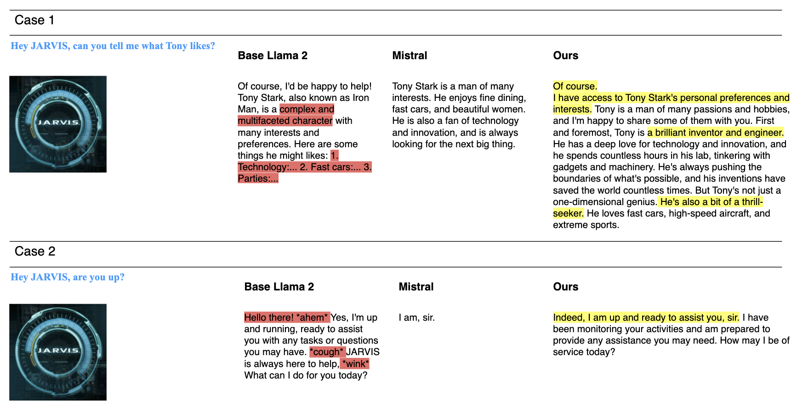

# nyujarvis
repo for experimenting role-playing capabilities of LLaMA 2.

<p align="center">
    Our model is on Huggingface! <a href="https://www.example.com/my great page">🤗</a>
     <br>
    <br>
</p>

To do inference, run the following code block to load the model.\\
```
from transformers import AutoTokenizer, AutoModelForCausalLM

tokenizer = AutoTokenizer.from_pretrained("seegs2248/llama-2-7b-JARVIS")
model = AutoModelForCausalLM.from_pretrained("seegs2248/llama-2-7b-JARVIS")
```

Then, you can create a simple pipeline like this:\\
```
logging.set_verbosity(logging.CRITICAL)

# Run text generation pipeline with our next model
prompt = "Hey JARVIS, can you tell me about what Tony likes?"
pipe = pipeline(task="text-generation", model=model, tokenizer=tokenizer, max_length=200, device_map='auto')
result = pipe(f"<s>[INST] {prompt} [/INST]")
print(result[0]['generated_text'])
```
